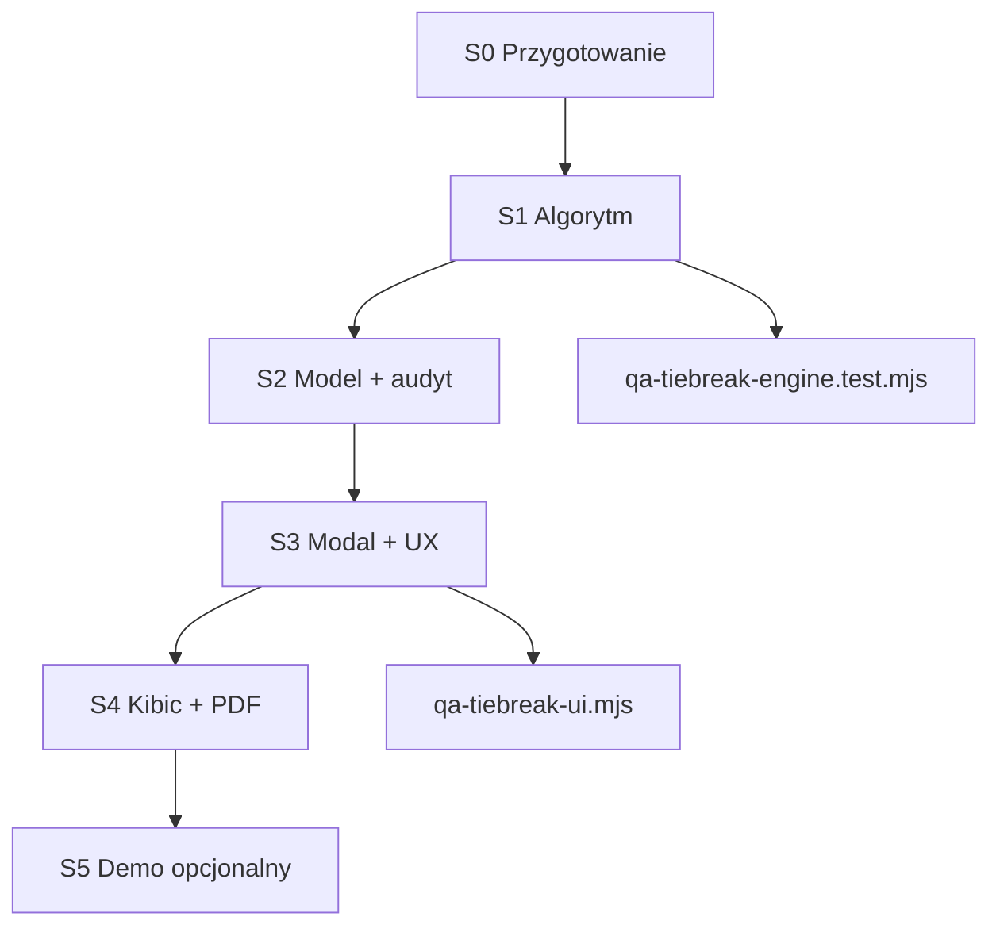

# GROUP_TIEBREAKER_IMPLEMENTATION_PLAN.md

**TurniejPro SaaS — Plan wdrożenia remisu absolutnego i tie-breakerów grupowych**

| Pole | Wartość |
|------|---------|
| **Wersja** | 1.0 |
| **Status** | Plan wdrożenia — **bez implementacji kodu** |
| **Data** | 2026-07-12 |
| **Dokument źródłowy** | [`GROUP_TIEBREAKER_SPEC.md`](GROUP_TIEBREAKER_SPEC.md) |
| **Architektura referencyjna** | Monolit `index.html` + opcjonalnie `demo-story.js` (embed) |

---

## Streszczenie wykonawcze

Plan przenosi zaakceptowaną specyfikację tie-breakerów na **konkretne zmiany w istniejącej architekturze TurniejPro SaaS**: monolityczny moduł sędziowski w `index.html`, synchronizacja Firebase Realtime Database, widok kibica (`isFanMode`), embed Demo Story (`initAppModuleBridge`), archiwum i PDF.

Wdrożenie podzielone jest na **6 sprintów technicznych** (S0–S5), z priorytetem na algorytm + audyt losowania przed pierwszym klientem produkcyjnym.

---

## Kontekst architektury (stan obecny)

### Warstwa danych turnieju

```javascript
state = {
  teams: [],
  groups: {},           // { "A": [{id, name}, ...], ... }
  matches: [],          // faza grupowa
  playoffs: [],
  settings: {
    advCount, bracketSize, start, gDur, ...
    customTableOrder: { "A": [teamId, ...] },      // ręczna kolejność
    confirmedTableOrder: { "A": true },            // zatwierdzenie
    qualifiedTeamIds: []                           // demo / override awansu
  },
  logs: []              // window.logAction()
}
```

**Persystencja:** `window.save()` → `db.ref('turnieje_uzytkownikow/' + activeKey).update(payload)`  
**Archiwum:** `archiveTournament()` → `{ ...state, _meta_name, _meta_date, _license_owner }`  
**Zmienne sesyjne (poza state):** `tempLocalOrders[gn]` — lokalna kolejność przed zatwierdzeniem

### Funkcje rankingowe (do refaktoryzacji)

| Funkcja | Plik | Rola |
|---------|------|------|
| `getSortedGroupStats(gn)` | `index.html` | Budowa statystyk + sort + h2h |
| `isAbsoluteRemis(a, b)` | `index.html` | Detekcja pary na cutoff |
| `calcTables()` | `index.html` | Render UI + blokada play-off |
| `moveTableTeam` / `confirmTableOrder` / `resetTableOrder` | `index.html` | Ręczna korekta |
| `getAdvancingTeamsFull()` | `index.html` | Awans do play-off |
| `generujPlayoff()` | `index.html` | Blokowany przy `anyUnconfirmedAbsoluteRemis` |

### Tryby działania wpływające na tie-breakery

| Tryb | Flaga | Wpływ |
|------|-------|-------|
| Organizator (live) | `!isFanMode && !isDemoMode` | Pełna edycja, save Firebase |
| Kibic (QR / link) | `isFanMode` | Readonly CSS, brak strzałek |
| Demo prezentacyjny | `isDemoMode` | Bez Firebase save |
| Demo Story embed | `_demoStoryFanEmbed`, `_demoStoryOrganizerEmbed` | `fanRo` ukrywa strzałki; scenariusz z `qualifiedTeamIds` |
| Archiwum | `view=archive`, `openArchive()` | Readonly, pełny snapshot `state` |

---

## 1. Zmiany w algorytmie tabel grupowych

### 1.1 Cel refaktoryzacji

Zastąpić **jednoprzebiegowe sortowanie globalne** w `getSortedGroupStats` modelem **wieloetapowym z klastrami**, zgodnym z GROUP_TIEBREAKER_SPEC §3.

### 1.2 Proponowana struktura modułu (logiczna — nadal w `index.html` lub wydzielony plik `tiebreak-engine.js`)

```
tiebreak/
├── buildRawGroupStats(gn, matches)      // pkt, bz, bs, m, w, r, p
├── identifyPointClusters(stats)           // segmenty o identycznym pkt
├── buildMiniTable(cluster, matches)       // mini_* dla |C| ≥ 2
├── compareTeamsTwoWay(a, b, mini)         // T2-2 … T2-6
├── compareTeamsMultiWay(cluster, mini)    // T3-3 … T3-7
├── sortCluster(cluster, matches)          // rekursywnie
├── mergeClustersIntoStandings(stats)      // finalna kolejność miejsc
└── getGroupStandings(gn)                  // zamiennik getSortedGroupStats
```

### 1.3 Zachowanie wsteczne pól

Aby nie psuć UI i istniejących testów demo:

| Obecne pole | Docelowe | Uwagi |
|-------------|----------|-------|
| `pkt, bz, bs, m, w, r, p` | bez zmian | tabela główna |
| `h2h_pkt, h2h_bz, h2h_bs` | alias `mini_*` dla klastra punktowego | kompatybilność renderera |
| `rank` | nadal 1…n po merge | |
| `group` | `gn` | |

### 1.4 Kolejność tie-breakerów (implementacja)

**Dla |C| = 2** — funkcja `compareTwoTeamCluster(a, b, directMatches)`:

1. `pkt` (warunek wejścia — już w klastrze)
2. `mini_pkt` (= wynik bezpośredni / h2h_pkt)
3. `mini_gd` (= h2h_bz - h2h_bs)
4. `mini_bz` (= h2h_bz)
5. `group_gd` (= bz - bs)
6. `group_bz` (= bz)
7. → remis absolutny pary

**Dla |C| ≥ 3** — funkcja `resolveMultiTeamCluster(C, matches)`:

1. Zbuduj mini-tabelę na meczach wewnątrz C
2. Sortuj wg mini_pkt → mini_gd → mini_bz → group_gd → group_bz
3. Jeśli podgrupa nadal remisuje → **rekursja** na podklaster C′
4. Jeśli cały C nierozstrzygnięty → flaga `absoluteTie: true`

### 1.5 Nadpisanie ręczne (priorytet nad algorytmem)

Kolejność aplikowania (bez zmian semantyki, jawne udokumentowanie):

```
1. buildRawGroupStats
2. resolveAllClusters (algorytm)
3. IF tempLocalOrders[gn] → sort by temp order
4. ELSE IF settings.customTableOrder[gn] → sort by saved order
5. assign rank
```

**Ważne:** Po wdrożeniu losowania `customTableOrder` musi być ustawiane **wyłącznie** przez `applyTieBreakDecision()`, nie bezpośrednio przez strzałki bez audytu.

### 1.6 Wyliczenie linii awansu (cutoff)

Bez zmian formuły:

```javascript
advPerGroup = Math.floor(settings.advCount / numGroups)
cutoffIndex = advPerGroup - 1  // między miejsca cutoffIndex a cutoffIndex+1
```

Nowość: sprawdzenie klastra **przecinającego** pozycje `[cutoffIndex, cutoffIndex+1, …]` gdy remis obejmuje > 2 drużiny.

### 1.7 Blokada przy niedokończonej fazie grupowej

Przed losowaniem / play-off:

```javascript
groupMatchesIncomplete = matches.filter(m => m.group === gn && !m.played).length > 0
clusterIncomplete = /* brak rozegranych meczów wewnątrz klastra */
```

Jeśli `groupMatchesIncomplete && criticalCluster` → stan UI `GROUP_INCOMPLETE`, brak losowania.

---

## 2. Implementacja rekursywnych klastrów 3+ drużyn

### 2.1 Algorytm wykrywania klastra krytycznego

**Wejście:** posortowana tabela `standings[]`, `cutoffIndex`, `advPerGroup`

**Kroki:**

1. Znajdź wszystkie klastry punktowe (ciągłe segmenty o tym samym `pkt`).
2. Dla każdego klastra C oblicz `rankRange` = indeksy miejsc w tabeli.
3. Klaster jest **krytyczny**, jeśli:
   - `min(rankRange) <= cutoffIndex` AND `max(rankRange) > cutoffIndex`, LUB
   - remis absolutny w C dotyczy miejsc awansowych (konfigurowalne: strict vs permissive).

**Przykład TV-03 (spec):** miejsca 2–4 remisują, awans 2 → klaster {A,B,C} jest krytyczny mimo że para (2,3) i (3,4) też remisują.

### 2.2 Rekursja w mini-tabeli

Pseudokod:

```
function resolveCluster(teamIds, matches, depth = 0):
  if teamIds.length <= 1: return teamIds
  if teamIds.length === 2:
    return sortTwo(teamIds) or markAbsoluteTie(teamIds)

  mini = buildMiniTable(teamIds, matches)
  sorted = sortByMiniCriteria(mini)

  // Wykryj podklastry punktowe w mini-tabeli
  subclusters = identifyPointClusters(sorted)
  result = []
  for sub in subclusters:
    if sub.length === 1:
      result.push(sub[0])
    else if isAbsoluteTieSubcluster(sub):
      result.push({ absoluteTie: true, teamIds: sub })
    else:
      result.push(...resolveCluster(sub.teamIds, matches, depth+1))
  return flatten(result)
```

**Limit rekursji:** `depth <= 8` (zabezpieczenie przed pętlą — w praktyce max 5 drużyn w grupie halowej).

### 2.3 Funkcja `isAbsoluteTieCluster(teamStats[])`

Zastępuje `isAbsoluteRemis(a, b)`:

```javascript
// Wszystkie drużyny w C mają identyczne:
// mini_pkt, mini_gd, mini_bz, group_gd, group_bz
// (dla |C|=2: mini = direct H2H)
```

Zwraca `{ absolute: boolean, criteriaExhausted: string[] }`.

### 2.4 Integracja z `getAdvancingTeamsFull`

Po rozstrzygnięciu wszystkich klastrów krytycznych:

- `getAdvancingTeamsFull()` bierze top `advPerGroup` z każdej grupy po finalnym rankingu.
- Jeśli istnieje nierozstrzygnięty klaster krytyczny → zwraca pustą listę LUB flagę błędu (preferowane: **blokada** z komunikatem).

### 2.5 Testy jednostkowe (offline, bez UI)

Plik docelowy: `scripts/tiebreak-engine.test.mjs` (Node, import czystej logiki)

Minimalny zestaw przed merge:
- TV-01 (cykl 3-drużynowy)
- TV-03 (klaster 3 na miejscach 2–4)
- TV-04 (para 2-drużynowa z remisem bezpośrednim)
- Regresja: normalna tabela 4×4 bez remisu (demo scenario standings)

---

## 3. Model danych TieBreakDecision

### 3.1 Schema (Firebase-safe JSON)

```typescript
interface TieBreakDecision {
  id: string;                      // crypto.randomUUID() lub timestamp-based
  version: 1;                      // migracje schema
  groupName: string;               // "A" | "B" | ...
  clusterTeamIds: number[];        // kolejność wejściowa (alfabetyczna po id)
  clusterTeamNames: string[];        // denormalizacja do archiwum
  clusterSize: number;
  cutoffRank: number;              // 1-based miejsce linii awansu w grupie
  advPerGroup: number;
  resolvedOrder: number[];         // teamIds — ustalona kolejność w klastrze
  method: 'ALGORITHM' | 'DRAW' | 'MANUAL' | 'FAIR_PLAY';
  criteriaExhausted: string[];     // enum keys — patrz §3.2
  drawSeed?: string;               // hex, 32 znaki — tylko DRAW
  drawTimestamp: string;           // ISO 8601
  actorLabel: string;              // np. licencja.notatka lub "Organizator"
  note?: string;                   // wymagane dla MANUAL
  manualReason?: 'ON_SITE_DRAW' | 'REFEREE_DECISION' | 'OTHER';
  snapshotBefore: TeamStatsSnapshot[];
  snapshotAfter: TeamStatsSnapshot[];
}

interface TeamStatsSnapshot {
  teamId: number;
  teamName: string;
  rank: number;
  pkt: number;
  bz: number;
  bs: number;
  mini_pkt?: number;
  mini_gd?: number;
}
```

### 3.2 Enum `criteriaExhausted`

| Klucz | Opis |
|-------|------|
| `POINTS` | Remis punktowy w grupie |
| `MINI_TABLE_PTS` | Remis w mini-tabeli (pkt) |
| `MINI_TABLE_GD` | Remis bilansu mini |
| `MINI_TABLE_GF` | Remis bramek zdobytych mini |
| `GROUP_GD` | Remis bilansu całej grupy |
| `GROUP_GF` | Remis bramek zdobytych w grupie |

### 3.3 Lokalizacja w `state`

```javascript
state.settings.tieBreakDecisions = [
  { id: "tb-...", groupName: "A", ... }
];

// Indeks szybki (opcjonalny, denormalizacja):
state.settings.tieBreakByGroup = {
  "A": "tb-..."   // id ostatniej decyzji dla grupy
};
```

**Zasada:** `tieBreakDecisions` jest **append-only** — brak edycji/usuwania po zatwierdzeniu (wyjątek: admin serwera).

### 3.4 Powiązanie z `customTableOrder`

Po decyzji DRAW / MANUAL:

```javascript
state.settings.customTableOrder[gn] = decision.resolvedOrder; // pełna kolejność grupy lub tylko segment
state.settings.confirmedTableOrder[gn] = true;
```

**Rekomendacja:** `customTableOrder[gn]` przechowuje **pełną** kolejność wszystkich drużyn w grupie (nie tylko klaster), aby `getGroupStandings` miał jedno źródło prawdy.

### 3.5 Generowanie ID losowania

```javascript
// Wymóg spec: CSPRNG
const seed = Array.from(crypto.getRandomValues(new Uint8Array(16)))
  .map(b => b.toString(16).padStart(2, '0')).join('');
```

Permutacja Fisher-Yates z seed jako audyt (opcjonalnie: zapisać kolejność losowań pośrednich).

---

## 4. Integracja z archiwum turnieju

### 4.1 Obecny przepływ archiwizacji

```javascript
archivePayload = { ...state, _meta_name, _meta_date, _license_owner }
db.ref('turnieje_uzytkownikow/' + key + '/archiwum').push(archivePayload)
db.ref('archiwum').push(archivePayload)
```

`state.settings.tieBreakDecisions` **automatycznie** trafi do archiwum dzięki spread `...state`.

### 4.2 Rozszerzenia metadanych archiwum

Dodać denormalizację dla czytelności raportów:

```javascript
_meta_tiebreaks: state.settings.tieBreakDecisions?.map(d => ({
  group: d.groupName,
  method: d.method,
  teams: d.clusterTeamNames,
  resolvedOrder: d.resolvedOrder.map(id => teamNameById(id)),
  timestamp: d.drawTimestamp,
  seed: d.drawSeed || null
}))
```

### 4.3 Zamrożenie sesji (`freezeTournament`)

Decyzje tie-break **muszą** być częścią `freezePayload` — ten sam obiekt `settings`.

### 4.4 Archiwum readonly (`openArchive`)

- `calcTables()` w trybie archiwum: pokazać banner rozstrzygnięć z `_meta_tiebreaks` lub `settings.tieBreakDecisions`.
- Brak przycisków losowania / strzałek (już zapewnia `readonlyCSS` + `isFanMode = true`).

### 4.5 Eksport PDF (`exportToPDF`)

Nowa sekcja po protokole meczowym:

**„⚖ Rozstrzygnięcia remisów absolutnych”**

Dla każdej decyzji:
- Grupa, drużyny, metoda, data, seed (jeśli losowanie), kolejność końcowa.

### 4.6 Logi sesji (`state.logs`)

Rozszerzyć `logAction` o structured helper:

```javascript
logTieBreakDecision(decision) {
  const names = decision.clusterTeamNames.join(', ');
  const methodLabel = { DRAW: 'losowaniem', MANUAL: 'decyzją ręczną', ... }[decision.method];
  logAction(`Gr. ${decision.groupName}: remis absolutny (${names}) — kolejność ustalona ${methodLabel}.`);
}
```

Wyświetlanie w `#system-log-display` (zakładka organizatora) — bez zmian struktury.

### 4.7 Firebase sync

`window.save()` już wysyła cały `settings` — **nowe pola syncują się automatycznie**.

**Uwaga:** Przy pierwszym load turnieju bez `tieBreakDecisions` → inicjalizacja `[]` (patrz §8 migracja).

---

## 5. UX remisu absolutnego

### 5.1 Maszyna stanów per grupa

| Stan | Warunek | UI |
|------|---------|-----|
| `NORMAL` | Brak klastra krytycznego lub rozstrzygnięty algorytmem | Zielone wiersze awansu |
| `POINTS_TIE_RESOLVED` | Klaster rozstrzygnięty mini-tabelą | Standard |
| `ABSOLUTE_TIE_PENDING` | Klaster krytyczny + `absoluteTie` + brak decyzji | Żółte wiersze, badge ⚠️ |
| `ABSOLUTE_TIE_DRAW_REQUIRED` | Jak wyżej + faza grupowa zakończona | Przycisk „Losuj kolejność” |
| `GROUP_INCOMPLETE` | Nierozegrane mecze w klasterze | Szary banner, brak losowania |
| `ABSOLUTE_TIE_CONFIRMED` | `tieBreakDecisions` dla grupy | Ikona ⚖, tooltip z metodą |

Implementacja: funkcja `getGroupTieState(gn)` zwracająca stan + metadane do renderu.

### 5.2 Zmiany w `calcTables()`

**Banner (zastąpić obecny):**

> 🟩 Na zielono zaznaczono drużyny premiowane awansem.  
> ⚖️ Przy remisie punktowym stosowana jest mini-tabela bezpośrednich spotkań.  
> 🎲 Przy remisie absolutnym organizator przeprowadza losowanie w systemie.

**Nagłówek tabeli grupy** — dynamiczny badge:

- `⚠️ Remis absolutny — wymagane losowanie` (PENDING)
- `⚖ Rozstrzygnięto losowaniem — 12.04.2026 14:32` (CONFIRMED)

**Wiersze klastera:** klasa `absolute-remis-row` dla **wszystkich** drużyn w klastrze krytycznym (nie tylko pary na cutoff).

### 5.3 Blokada play-off

Obecna logika:

```javascript
if (anyUnconfirmedAbsoluteRemis) { poBtn.disabled = true; ... }
```

Rozszerzyć:

```javascript
const blocked = Object.keys(groups).some(gn => {
  const s = getGroupTieState(gn);
  return s === 'ABSOLUTE_TIE_PENDING' || s === 'ABSOLUTE_TIE_DRAW_REQUIRED' || s === 'GROUP_INCOMPLETE';
});
```

### 5.4 Ręczne strzałki (↑↓) — zmiana procesu

**Obecnie:** dowolna permutacja bez audytu.

**Docelowo:**

- Strzałki dozwolone **tylko** gdy `ABSOLUTE_TIE_PENDING` lub `ABSOLUTE_TIE_DRAW_REQUIRED`.
- `confirmTableOrder(gn)` otwiera **mini-formularz** (notatka + powód) zamiast natychmiastowego zapisu.
- Zapis → `TieBreakDecision` z `method: 'MANUAL'`.

Strzałki **zablokowane** gdy kolejność wynika wyłącznie z algorytmu (NORMAL).

### 5.5 Przewodnik demo (`DEMO_GUIDES.tabele`)

Zaktualizować copy w `index.html`:

> Zielone wiersze = awans. Mini-tabela przy remisie punktowym. Przy remisie absolutnym — losowanie z zapisem w protokole.

---

## 6. Modal losowania

### 6.1 Trigger

Przycisk **„🎲 Losuj kolejność”** w nagłówku tabeli grupy ze stanem `ABSOLUTE_TIE_DRAW_REQUIRED`.

Warunki wstępne (guard):
- `!isFanMode && !isDemoMode` (demo story: osobna ścieżka — §7)
- wszystkie mecze grupowe w grupie `played === true`
- klaster krytyczny z `absoluteTie === true`
- brak istniejącej decyzji dla grupy

### 6.2 Struktura HTML (nowy modal)

Dodać do `#view-app` (obok `#matchModal`):

```html
<div id="tieBreakModal" class="modal">
  <div class="modal-content">
    <h4>⚖ Remis absolutny — Gr. <span id="tb-group"></span></h4>
    <p id="tb-cluster-teams"></p>
    <div id="tb-criteria-list"></div>
    <div id="tb-draw-animation"></div>
    <p id="tb-draw-result" style="display:none;"></p>
    <p id="tb-draw-seed" class="demo-micro"></p>
    <button id="tb-draw-run" class="btn-main">Losuj kolejność</button>
    <button id="tb-draw-confirm" class="btn-main" style="display:none;">Zatwierdź i zapisz</button>
    <button onclick="closeModal('tieBreakModal')">Anuluj</button>
  </div>
</div>
```

### 6.3 Przepływ UX (3 kroki)

1. **Podgląd** — lista drużyn w klastrze, wyczerpane kryteria, informacja o linii awansu.
2. **Losowanie** — klik „Losuj” → animacja 1–2 s → prezentacja kolejności + seed (hex skrócony + „Kopiuj pełny seed”).
3. **Zatwierdzenie** — „Zatwierdź i zapisz” → zapis `TieBreakDecision`, `save()`, `calcTables()`, zamknięcie modala.

**Organizator musi kliknąć Losuj** — brak auto-losowania przy wykryciu remisu (świadoma decyzja na hali).

### 6.4 Losowanie 3 drużyn

Jedna permutacja `[t2, t1, t3]` → przypisanie miejsc w klastrze.

Przykład komunikatu w modalu po losowaniu:

> Kolejność: 1. FC Orły · 2. Lech Mini · 3. Red Dragons  
> Seed: `a3f8c2...` · 12.04.2026 14:32

### 6.5 Bezpieczeństwo i audyt

- `crypto.getRandomValues` — **nie** `Math.random()`
- Seed zapisywany w `TieBreakDecision.drawSeed`
- Po zatwierdzeniu: brak możliwości ponownego losowania bez `resetTableOrder` + wpis admina (opcjonalnie: tylko przed startem play-off)

---

## 7. Zmiany w widoku kibica

### 7.1 Tryb kibica live (`?id=KEY` bez admin)

Obecnie: `readonlyCSS` ukrywa filtry, strzałki, przyciski edycji.

**Dodać:**

| Element | Zachowanie kibica |
|---------|-------------------|
| Remis absolutny (pending) | **Nie pokazywać** szczegółów losowania w trakcie — opcjonalnie: „Klasyfikacja grupy A zostanie uzupełniona” |
| Po zatwierdzeniu decyzji | Banner: „⚖ Kolejność w Gr. A ustalona losowaniem” + kolejność (bez seedu pełnego — skrót) |
| Tabele | Bez strzałek (już `fanRo`) |
| Logi | Ukryte (organizator only) |

### 7.2 Demo Story — widok kibica E2 (Tabele)

Plik: `demo-story.js` → `mountFanEmbed`, `calcTables` z `_demoStoryFanEmbed`.

- Scenariusz demo **nie powinien** pokazywać remisu absolutnego (standings precomputed, `qualifiedTeamIds`).
- Jeśli w przyszłości scenariusz TV-01: osobna ścieżka prezentacji sprzedażowej (Sprint S5 — opcjonalny).

### 7.3 Archiwum kibica (`openArchive`)

- Pełna historia `tieBreakDecisions` w readonly.
- Sekcja nad tabelami: skrót rozstrzygnięć.

### 7.4 CSS readonly — rozszerzenie

Dodać do `readonlyCSS`:

```css
#tb-draw-run, #tb-draw-confirm, .tiebreak-action-btn { display: none !important; }
.table-order-btn, .table-save-btn, .table-reset-btn { display: none !important; } /* już częściowo */
```

### 7.5 Realtime update

Po `save()` Firebase → kibic z `.on('value')` odświeża tabelę.

**Wymaganie:** listener Firebase musi re-renderować `calcTables()` po zmianie `settings.tieBreakDecisions` (sprawdzić istniejący listener — jeśli brak, dodać w init load).

---

## 8. Migracja istniejących turniejów

### 8.1 Zasada nadrzędna

**Nie przeliczaj retroaktywnie** kolejności turniejów z `confirmedTableOrder === true`.

### 8.2 Load hook (przy starcie turnieju)

```javascript
function migrateTieBreakSettings(settings) {
  if (!settings) return { tieBreakDecisions: [] };
  if (!settings.tieBreakDecisions) settings.tieBreakDecisions = [];

  // Retroaktywna rekonstrukcja wpisu MANUAL z confirmedTableOrder
  Object.keys(settings.confirmedTableOrder || {}).forEach(gn => {
    if (settings.confirmedTableOrder[gn] && !settings.tieBreakByGroup?.[gn]) {
      settings.tieBreakDecisions.push({
        id: 'legacy-' + gn,
        version: 1,
        groupName: gn,
        method: 'MANUAL',
        note: 'Kolejność zatwierdzona przed wdrożeniem modułu tie-break (migracja automatyczna).',
        drawTimestamp: new Date(0).toISOString(),
        actorLabel: 'Migracja systemu',
        resolvedOrder: settings.customTableOrder[gn] || [],
        criteriaExhausted: ['LEGACY_MANUAL'],
        ...
      });
    }
  });
  return settings;
}
```

### 8.3 Turnieje w trakcie (live)

| Sytuacja | Akcja |
|----------|-------|
| Brak remisu | Nowy algorytm — wynik identyczny lub lepszy (mini-tabela bez zmian) |
| Remis wykryty po update | Nowy flow losowania |
| Stare strzałki bez confirmed | Traktuj jak `tempLocalOrders` — wymuś confirm z audytem |

### 8.4 Demo Story scenario

`demo-story-scenario/standings.json` + `qualifiedTeamIds` + `customTableOrder` — **bez zmian** w migracji; test regresji: smoke E0→E7.

### 8.5 Archiwum historyczne

Readonly — migracja przy `openArchive` tylko do wyświetlania (opcjonalny banner „brak danych audytu losowania”).

---

## 9. QA test vectors

### 9.1 Warstwa silnika (Node, bez Playwright)

Plik: `scripts/tiebreak-engine.test.mjs`

| ID | Opis | Assert |
|----|------|--------|
| TV-01 | Cykl 3×1:0 | `absoluteTie`, cluster size 3 |
| TV-02 | Tabela 4×4 normalna | brak absoluteTie |
| TV-03 | Lider + cykl miejsc 2–4 | critical cluster {A,B,C} |
| TV-04 | Para 7 pkt, remis 2:2 H2H | T2 rozstrzyga lub absoluteTie |
| TV-05 | Para na cutoff | bez losowania jeśli T2 rozstrzyga |
| TV-06 | Rekursja: 4 drużiny, podklaster 3 | poprawna kolejność |
| TV-07 | Niedokończone mecze w klastrze | `GROUP_INCOMPLETE` |
| TV-REG-01 | Demo scenario standings A–D | identyczne top 2 jak `qa-demo-tables-standings.mjs` |

### 9.2 Warstwa UI (Playwright)

Plik: `scripts/qa-tiebreak-ui.mjs`

| ID | Scenariusz | Assert |
|----|------------|--------|
| UI-01 | Wstrzyknięty TV-01 przez test harness | żółte wiersze, play-off disabled |
| UI-02 | Klik Losuj → Zatwierdź | `tieBreakDecisions.length === 1`, play-off enabled |
| UI-03 | Widok kibica po decyzji | banner readonly, brak przycisku losowania |
| UI-04 | Archiwum po decyzji | `_meta_tiebreaks` obecne |
| UI-05 | PDF | sekcja rozstrzygnięć (smoke — tekst w HTML przed export) |

### 9.3 Regresja pakietu demo

Po każdej zmianie w silniku:

```bash
node scripts/qa-demo-tables-standings.mjs
node scripts/qa-demo-story-smoke.mjs
node scripts/tiebreak-engine.test.mjs
node scripts/qa-tiebreak-ui.mjs
```

### 9.4 Harness testowy (dev)

Opcjonalny tryb `?tiebreakTest=TV-01` ładujący sztuczne wyniki meczów — **tylko dev**, nie produkcja.

---

## 10. Kolejność implementacji

### Sprint S0 — Przygotowanie (1–2 dni)

| # | Zadanie | Deliverable |
|---|---------|-------------|
| S0.1 | Wydzielenie logiki do `tiebreak-engine.js` (pure functions) | Plik + import w `index.html` |
| S0.2 | `migrateTieBreakSettings()` w load | Brak regresji starych turniejów |
| S0.3 | TV-REG-01 + TV-02 testy | CI lokalny |

### Sprint S1 — Algorytm klastrów (3–5 dni)

| # | Zadanie | Deliverable |
|---|---------|-------------|
| S1.1 | `buildRawGroupStats`, `identifyPointClusters` | Testy |
| S1.2 | `buildMiniTable`, compare T2 / T3 | TV-04, TV-05 |
| S1.3 | Rekursja `resolveCluster` | TV-01, TV-03, TV-06 |
| S1.4 | `getGroupStandings` zamiennik `getSortedGroupStats` | Adapter kompatybilności pól h2h_* |
| S1.5 | `getGroupTieState`, `isAbsoluteTieCluster` | Zastąpienie `isAbsoluteRemis` |

### Sprint S2 — Model danych + audyt (2–3 dni)

| # | Zadanie | Deliverable |
|---|---------|-------------|
| S2.1 | Schema `TieBreakDecision` + factory | Dokumentacja inline |
| S2.2 | `applyTieBreakDecision()`, `logTieBreakDecision()` | Integracja z save |
| S2.3 | Refactor `confirmTableOrder` → MANUAL z audytem | Formularz notatki |
| S2.4 | `_meta_tiebreaks` w archiwum | Test UI-04 |

### Sprint S3 — Modal losowania + UX (3–4 dni)

| # | Zadanie | Deliverable |
|---|---------|-------------|
| S3.1 | HTML/CSS `#tieBreakModal` | Modal |
| S3.2 | CSPRNG draw + Fisher-Yates | TV-01 UI |
| S3.3 | Przepływ Losuj → Zatwierdź | UI-02 |
| S3.4 | Aktualizacja `calcTables` (stany, bannery, badge) | UX §5 |
| S3.5 | Blokada play-off rozszerzona | UI-01 |

### Sprint S4 — Kibic + PDF + Demo (2 dni)

| # | Zadanie | Deliverable |
|---|---------|-------------|
| S4.1 | Widok kibica readonly | UI-03 |
| S4.2 | Sekcja PDF rozstrzygnięć | UI-05 |
| S4.3 | Demo Story regresja | smoke E0→E7 |
| S4.4 | Aktualizacja `DEMO_GUIDES.tabele` | Copy |

### Sprint S5 — Opcjonalny scenariusz sprzedażowy (1–2 dni, P2)

| # | Zadanie | Deliverable |
|---|---------|-------------|
| S5.1 | Scenariusz TV-01 w osobnym bundle / branch demo | Sales path |
| S5.2 | Sekcja w `DEMO_STORY_SALES_KIT.md` | Dokumentacja |

**Szacowany łączny czas:** 11–16 dni roboczych (1 dev), bez S5.

### Diagram zależności



---

## Podsumowanie końcowe

### Szacowany poziom ryzyka

| Obszar | Poziom | Komentarz |
|--------|--------|-----------|
| **Algorytm rankingowy** | 🟠 **Średni–wysoki** | Rekursja klastrów + regresja awansu do play-off; łagodzone testami TV-* i TV-REG-01 |
| **Integracja Firebase** | 🟢 **Niski** | Append-only `tieBreakDecisions` w istniejącym `settings` |
| **UX / organizator na hali** | 🟠 **Średni** | Nowy modal w czasie presji; wymaga krótkiego copy i 1-klik flow |
| **Widok kibica** | 🟢 **Niski** | Readonly, additive banners |
| **Demo Story** | 🟢 **Niski** | Scenariusz bez remisu absolutnego; regresja smoke |
| **Migracja starych turniejów** | 🟡 **Średni–niski** | `confirmedTableOrder` → legacy MANUAL; bez przeliczania |
| **Całość wdrożenia** | 🟠 **Średni** | Kluczowe: S1 + S2 + S3 przed produkcją; S5 opcjonalny |

### Wpływ na istniejące turnieje

| Typ turnieju | Wpływ |
|--------------|-------|
| **Zakończone / zarchiwizowane** | Brak zmian rankingów; opcjonalny wpis legacy MANUAL przy pierwszym otwarciu |
| **W trakcie z confirmedTableOrder** | Kolejność zachowana; dodany rekord audytu legacy |
| **W trakcie bez remisu** | Nowy algorytm — wynik powinien być identyczny z obecnym |
| **W trakcie z wykrytym remisem (strzałki)** | Wymagany nowy flow confirm z notatką lub losowanie |
| **Nowe turnieje** | Pełny flow od początku |
| **Demo Story** | Bez zmian scenariusza; regresja QA obowiązkowa |

### Rekomendacja wdrożenia przed pierwszym klientem produkcyjnym

**TAK — wdrożyć S0 + S1 + S2 + S3 + S4 przed pierwszym płatnym turniejem na żywo.**

Uzasadnienie:

1. **Obecne strzałki bez audytu** to ryzyko organizacyjne i prawne (spór o awans) — większe niż koszt wdrożenia.
2. **Remis absolutny w grupie 3** (cykl 1:0) jest realny na halówkach — system bez losowania blokuje play-off bez jasnej procedury.
3. **Algorytm mini-tabeli już istnieje** — wdrożenie to rozszerzenie, nie przepisanie od zera; ryzyko kontrolowane testami TV-*.
4. **Demo Story nie wymaga zmiany** do launchu — scenariusz sprzedażowy bez remisu absolutnego wystarczy na pierwsze rozmowy.

**Minimalny scope MVP przed klientem (Must Have):**

- [x] Specyfikacja (GROUP_TIEBREAKER_SPEC.md) ✅
- [ ] S1: algorytm klastrów + TV-01/02/03/05
- [ ] S2: TieBreakDecision + log + archiwum
- [ ] S3: modal losowania CSPRNG
- [ ] S4: kibic readonly + regresja demo smoke
- [ ] `qa-tiebreak-engine.test.mjs` + `qa-tiebreak-ui.mjs` green

**Może poczekać (Should Have — po pierwszym evencie):**

- S5: scenariusz demo z remisem absolutnym
- Fair Play jako kryterium (F7)
- Template regulaminu PDF dla organizatora

**Nie wdrażać przed klientem:**

- Automatyczne losowanie bez kliknięcia organizatora
- `Math.random()` zamiast CSPRNG
- Edycja/usuwanie decyzji tie-break po zatwierdzeniu

---

## Historia dokumentu

| Wersja | Data | Zmiany |
|--------|------|--------|
| 1.0 | 2026-07-12 | Pierwszy plan wdrożenia na podstawie GROUP_TIEBREAKER_SPEC.md |

---

*Koniec dokumentu GROUP_TIEBREAKER_IMPLEMENTATION_PLAN.md*
