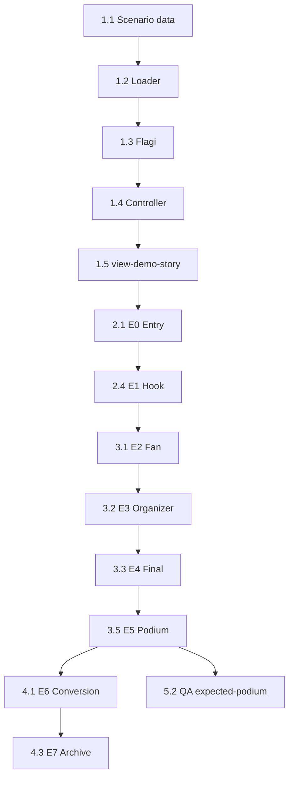

# Sprint A — Plan wdrożenia Demo Story MVP

**Wersja:** 1.0  
**Status:** Do realizacji  
**Data:** 2026-07-11  
**Cel sprintu:** Uruchomić liniowy flow **E0→E7** w istniejącej aplikacji TurniejPro SaaS  
**Poza sprintem:** animacje, E8, A/B copy, persystencja sesji, Firebase sandbox

**Dokumenty referencyjne:**  
`PRD_DEMO_STORY.md` · `COPY_DECK_DEMO_STORY.md` · `WIREFRAME_DEMO_STORY.md` · `IMPLEMENTATION_DEMO_STORY.md` · `demo-story-scenario/`

---

## 1. Cel Sprint A

| Co robimy | Czego nie robimy |
|-----------|------------------|
| Liniowy flow E0→E7 | E8 „Chcesz zobaczyć więcej?” |
| Jedna interakcja: wynik finału | Animacje podium / transitions |
| Ładowanie `demo-story-scenario/` | Refactor całego monolitu |
| CTA konwersyjne (link do aktywacji) | Lead capture / CRM |
| Podstawowe zdarzenia analityczne (console stub) | Pełna integracja analytics provider |
| Izolacja od produkcji (brak Firebase write) | Usunięcie legacy DEMO-2026 (można ukryć) |

**Definition of Done Sprint A:**  
Organizator przechodzi od ekranu wejścia do archiwum bez klucza licencyjnego, wpisuje wynik finału, widzi auto podium, trafia na CTA — zgodnie z `expected-podium.json` przy wyniku 3:2.

---

## 2. Minimalny zakres MVP (Sprint A)

### 2.1 In scope

| ID | Ekran | Minimalna implementacja |
|----|-------|-------------------------|
| E0 | Wejście | Nowy entry point na `#view-login` lub `#view-demo-story`; CTA start + link „Mam klucz” |
| E1 | Hook | Statyczny ekran + hero metrics 16/56/55 |
| E2 | Widok Kibica | Osadzenie istniejących rendererów w trybie readonly (mecze, tabele, play-off) |
| E3 | Panel Organizatora | Status 55/56 + karta finału; reuse `#tournament-dashboard` lub uproszczony wariant |
| E4 | Finał | Reuse `#matchModal` lub dedykowany formularz — jeden mecz m056 |
| E5 | Podium | Reuse `renderPodium()` + `calcStats()` po zapisie finału |
| E6 | Konwersja | Statyczny ekran copy + CTA → `#view-login` / aktywacja |
| E7 | Archiwum | Karta archiwum z `archive.json`; CTA powtórzone |

### 2.2 Out of scope Sprint A

- Auto-advance E5→E6 po timerze  
- FAQ accordion na E6  
- Strzelcy opcjonalni w finałe  
- Deep link `?demo=story` (nice-to-have, nie blokuje)  
- Walidacja QA automatyczna (`expected-podium.json` — manual QA)  
- Usunięcie `generateDemoMockData()` — w Sprint A **ukrywamy**, nie usuwamy  

---

## 3. Architektura — nowe komponenty (logiczne)

Monolit pozostaje w `index.html`. Nowe komponenty to **moduły JS + sekcje DOM** — bez frameworka.

### 3.1 `DemoStoryController`

**Rola:** Maszyna stanów E0→E7.

| Odpowiedzialność | API (propozycja) |
|------------------|------------------|
| Start sesji demo | `demoStory.start()` |
| Nawigacja do przodu | `demoStory.goTo(step)` |
| Aktualny krok | `demoStory.getStep()` |
| Zapis finału → przejście E5 | `demoStory.saveFinalScore(g1, g2)` |
| Wyjście do aktywacji | `demoStory.exitToLicense()` |
| Czy demo aktywne | `demoStory.isActive()` |

**Reguły:**
- Brak skoku do E5 bez zapisu E4  
- `browser back` → confirm (MVP: prosty `confirm()`)  
- Jeden primary CTA na ekran  

### 3.2 `DemoScenarioLoader`

**Rola:** Ładuje `demo-story-scenario/*.json` i mapuje na format `state` aplikacji.

| Wejście | Wyjście |
|---------|---------|
| `teams.json`, `matches.json`, `groups.json`, `playoff-bracket.json`, `players.json` | Obiekt `state` kompatybilny z istniejącymi rendererami |

**Kluczowe mapowanie:**

```
scenario.teams     → state.teams[]     { id, name, gk, cap }
scenario.matches   → state.matches[]   { id, group, time, t1, t2, g1, g2, played, s1, s2 }
scenario.playoffs  → state.playoffs[]  { id, n, time, t1, t2, g1, g2, played, ... }
scenario.meta      → state.settings + state._demoMeta
```

Finał (`m056`) → ostatni element `state.playoffs` z `played: false`.

**Sposób ładowania Sprint A:**  
Pliki JSON osadzone jako stałe JS (`const DEMO_SCENARIO = {...}`) wygenerowane z katalogu — **bez fetch** (działa offline, zero CORS). Refactor na fetch w Sprint B opcjonalnie.

### 3.3 `DemoStoryChrome`

**Rola:** Wspólny header flow demo.

| Element DOM | ID propozycja |
|-------------|---------------|
| Kontener chrome | `#demo-story-chrome` |
| Badge | `#demo-story-badge` → „DEMO STORY” |
| Progress | `#demo-story-progress` → „Krok 2 z 6” |
| Logo / tytuł | reuse logo z login |

Widoczny na E1–E6. Ukryty na E0 i E7 (epilog).

### 3.4 `DemoStoryScreens`

**Rola:** Renderer treści per ekran — copy z `COPY_DECK_DEMO_STORY.md`.

| Ekran | Kontener DOM | Renderer |
|-------|--------------|----------|
| E0 | `#demo-screen-entry` | `renderDemoEntry()` |
| E1 | `#demo-screen-hook` | `renderDemoHook()` |
| E2 | `#demo-screen-fan` | `renderDemoFanView()` |
| E3 | `#demo-screen-organizer` | `renderDemoOrganizer()` |
| E4 | `#demo-screen-final` | `renderDemoFinal()` |
| E5 | `#demo-screen-podium` | `renderDemoPodium()` |
| E6 | `#demo-screen-conversion` | `renderDemoConversion()` |
| E7 | `#demo-screen-archive` | `renderDemoArchive()` |

Jeden kontener nadrzędny: `#view-demo-story` z jednym aktywnym `.demo-screen.active`.

### 3.5 `DemoStoryFanEmbed`

**Rola:** Opakowanie istniejących rendererów kibica na E2.

| Reuse | Istniejąca funkcja | Zakładka |
|-------|-------------------|----------|
| Terminarz / wyniki | `filterAndRenderMatches()` | „Mecze” |
| Tabela | `calcTables()` | „Tabele” |
| Play-off | `renderPlayoffTree()` | „Play-Off” |

**Mechanizm Sprint A:**  
Tymczasowo ustawić flagę `isFanMode = true` (readonly), wyrenderować zawartość do `#demo-fan-embed`, dodać lokalne taby bez globalnego `#view-app .nav-tabs`.

### 3.6 `DemoStoryAnalytics` (stub)

**Rola:** Emitowanie zdarzeń z IMPLEMENTATION §10.

Sprint A: `console.log` + opcjonalnie `window.demoStoryEvents[]` do manual QA.

```javascript
track('demo_story_started', { session_id, entry_point })
track('demo_story_step_viewed', { step_id, step_name })
// ...
```

---

## 4. Nowe stany aplikacji

### 4.1 Flagi globalne (nowe)

| Flaga | Typ | Domyślnie | Opis |
|-------|-----|-----------|------|
| `isDemoStoryMode` | boolean | `false` | Aktywny flow Demo Story (≠ legacy `isDemoMode`) |
| `demoStoryStep` | number | `0` | Aktualny ekran 0–7 |
| `demoSessionId` | string | `null` | UUID sesji analitycznej |
| `demoStoryCompleted` | boolean | `false` | Po E7 |

### 4.2 Flagi istniejące — zachowanie w Demo Story

| Flaga | Wartość podczas Demo Story |
|-------|----------------------------|
| `isDemoMode` (`?id=DEMO-2026`) | **Nie używać** — legacy; ukryć entry |
| `isFanMode` | `true` na E2; `false` na E3–E4 |
| `activeKey` | brak / null — brak Firebase path |
| `viewMode` | brak lub `demo-story` |

### 4.3 Stan danych turnieju demo

| Moment | `state` | Finał | Turniej |
|--------|---------|-------|---------|
| Po load scenariusza | preloaded z loadera | `played: false` | aktywny |
| E1–E4 przed zapisem | bez zmian | pending | 55/56 |
| Po zapisie E4 | finał updated | `played: true` | zamknięty |
| E5–E7 | podium wyliczone | rozstrzygnięty | 56/56 |

### 4.4 Maszyna stanów (skrót)

```
IDLE → E0 → E1 → E2 → E3 → E4 →[save]→ E5 → E6 → E7 → END
         ↓
    exitToLicense → view-login (bez demo)
```

---

## 5. Miejsca integracji w `index.html`

### 5.1 Mapa pliku — gdzie dotykamy

```
index.html
├── <style>                    ← [A] Style Demo Story (nowa sekcja CSS)
├── <body>
│   ├── #view-login            ← [B] E0: rozszerzyć o CTA „Zobacz finał” LUB redirect
│   ├── #view-demo-story       ← [C] NOWY widok top-level (główny kontener flow)
│   ├── #view-admin            ← bez zmian
│   └── #view-app              ← [D] Reuse rendererów; ukryty podczas demo story
├── executeRouter()            ← [E] Nowa gałąź routingu demo story
├── initLoginModule()          ← [F] CTA start demo + „Mam klucz”
├── initAppModule()            ← [G] Guard: nie startuj jeśli isDemoStoryMode
├── generateDemoMockData()     ← [H] NIE ruszać w Sprint A; zdeprecjonować entry
├── isDemoMode block (~1799)   ← [I] Ukryć / nie linkować z E0
├── filterAndRenderMatches()   ← [J] Reuse na E2
├── calcTables()               ← [J] Reuse na E2
├── renderPlayoffTree()        ← [J] Reuse na E2
├── renderPodium()             ← [K] Reuse na E5
├── calcStats()                ← [K] Reuse na E5
├── matchModal / openMatch()   ← [L] Reuse lub fork na E4
├── renderDashboard()          ← [M] Reuse na E3 (z guardem demo)
└── switchTab()                ← [N] Zablokować globalnie w demo story
```

### 5.2 Szczegóły integracji per punkt

#### [B] `#view-login` — E0 Wejście

**Obecnie:** Tylko aktywacja klucza (`verifyLicense()`).

**Sprint A:**
- Dodać primary CTA „Zobacz finał turnieju” → `demoStory.start()`
- Secondary „Mam klucz — aktywuj licencję” → obecny formularz (bez zmian logiki)
- Microcopy: „Bez rejestracji · Demo nie wymaga klucza”

**Alternatywa (zalecana):** E0 jako pierwszy ekran w `#view-demo-story`; `#view-login` pozostaje dla „Mam klucz” i powrotu z E6.

#### [C] `#view-demo-story` — NOWY widok

Wstawić **po** `#view-login`, **przed** `#view-admin`:

```html
<div id="view-demo-story" class="view">
  <div id="demo-story-chrome">...</div>
  <div id="demo-screen-entry" class="demo-screen">...</div>
  <div id="demo-screen-hook" class="demo-screen">...</div>
  <!-- E2–E7 -->
</div>
```

#### [E] `executeRouter()` — linia ~567

**Obecna logika:**
```
admin → view-admin
activeKey || archiveId → view-app
else → view-login
```

**Nowa logika Sprint A:**
```
admin → view-admin
urlParams.get('demo') === 'story' OR demoStoryResume → view-demo-story
activeKey || archiveId → view-app  (bez DEMO-2026 w E0)
else → view-login (z CTA demo) LUB view-demo-story (E0)
```

**Decyzja produktowa Sprint A:**  
Domyślny entry bez parametrów = **E0 w `#view-login`** z przyciskiem start. Po kliknięciu → `#view-demo-story`.

#### [G] `initAppModule()` — guard

Na początku:
```javascript
if (isDemoStoryMode) return; // app module nie startuje Firebase listener
```

Demo Story **nie** wchodzi przez `?id=DEMO-2026`.

#### [J] Widok kibica E2

Tymczasowy patch w `DemoStoryFanEmbed`:

1. Zapisać `prevFanMode = isFanMode`  
2. Ustawić `isFanMode = true`  
3. Wywołać istniejące renderery do `#demo-fan-embed`  
4. Przy exit E2: przywrócić flagę  

**Ukryć w embed:** `#demo-guide-container`, header organizatora, przyciski destrukcyjne.

#### [L] Finał E4

**Opcja A (zalecana Sprint A):** Dedykowany prosty formularz w `#demo-screen-final` — tylko dwa inputy wyniku + CTA. Wywołuje logikę zapisu wycinkową z `openMatch()` / save match bez otwierania modala.

**Opcja B:** Otworzyć `#matchModal` prefill finałem — szybsze, ale gorsze UX (moduł organizatora widoczny).

#### [K] Podium E5

Po zapisie finału:
1. Ustawić `played: true` na finale w `state.playoffs`  
2. Wywołać `renderPodium()` → output do `#demo-screen-podium`  
3. Nadpisać wrapperem copy z Copy Deck (H1 „Turniej zamknięty”)  
4. Primary CTA „Chcę taki turniej u siebie” → E6  

**Peak-end rule:** E6 **natychmiast po** E5 — nie po E7.

#### [M] Panel organizatora E3

Reuse `#tournament-dashboard` / `renderDashboard()`:
- Pokazać: drużyny 16, mecze 55/56, faza finału  
- Ukryć: przyciski freeze/reset/restore  

Alternatywa: statyczny HTML z danymi z `tournament.meta.json` — szybsze na Sprint A.

---

## 6. Kolejność prac (Sprint A)

### Faza 1 — Fundament (D1–D2)

| # | Task | Output | Blokuje |
|---|------|--------|---------|
| 1.1 | Konwersja `demo-story-scenario/` → `DEMO_SCENARIO` JS object | `demo-scenario.data.js` lub inline const | wszystko |
| 1.2 | `DemoScenarioLoader.load()` → `state` | Funkcja + test manualny: 16 drużyn, 56 meczów | E2–E5 |
| 1.3 | Flagi: `isDemoStoryMode`, `demoStoryStep`, `demoSessionId` | Globalne zmienne | controller |
| 1.4 | `DemoStoryController` — szkielet FSM | start, goTo, getStep | ekrany |
| 1.5 | `#view-demo-story` + CSS minimal | HTML + `.demo-screen` toggle | UI |

### Faza 2 — Entry + nawigacja (D2–D3)

| # | Task | Output |
|---|------|--------|
| 2.1 | E0 — copy + CTA w `#view-login` | Start demo |
| 2.2 | `executeRouter()` — gałąź demo story | Routing |
| 2.3 | `DemoStoryChrome` — badge + progress | E1–E6 |
| 2.4 | E1 Hook — hero metrics | Copy + 16/56/55 |
| 2.5 | Nawigacja E0→E1→… + guard wstecz | FSM wired |

### Faza 3 — Reuse modułów (D3–D5)

| # | Task | Output |
|---|------|--------|
| 3.1 | E2 FanEmbed — mecze + tabele + play-off | WOW #1 |
| 3.2 | E3 Organizator — status 55/56 | Spokój / kontrola |
| 3.3 | E4 Finał — formularz + walidacja | Jedyna interakcja |
| 3.4 | Zapis finału → update `state.playoffs` | Trigger podium |
| 3.5 | E5 Podium — reuse `renderPodium()` | WOW #3 / PEAK |

### Faza 4 — Konwersja + epilog (D5–D6)

| # | Task | Output |
|---|------|--------|
| 4.1 | E6 Konwersja — copy + CTA | Aktywacja / kontakt |
| 4.2 | `exitToLicense()` → `#view-login` z focus na input | Zachowanie „Mam klucz” |
| 4.3 | E7 Archiwum — karta z `archive.json` | Epilog ≤15 s |
| 4.4 | Ukrycie legacy DEMO-2026 entry | Brak konfliktu dwóch demo |

### Faza 5 — QA + analytics stub (D6–D7)

| # | Task | Output |
|---|------|--------|
| 5.1 | `DemoStoryAnalytics` stub | Zdarzenia w console |
| 5.2 | Manual QA vs `expected-podium.json` (3:2) | Checklist PASS |
| 5.3 | Mobile smoke test (375px) | E2 fan embed czytelny |
| 5.4 | Guard: brak Firebase write w demo story | Izolacja |

---

## 7. Zależności między taskami



**Ścieżka krytyczna:** Scenario → Loader → Controller → E4 save → E5 podium → E6 CTA.

---

## 8. Ryzyka Sprint A i mitygacja

| Ryzyko | Mitygacja w sprintcie |
|--------|----------------------|
| Format `state` ≠ scenario JSON | Task 1.2 jako pierwszy; test renderu meczów przed UI |
| `renderPodium()` nie działa na 16 drużyn | Test E5 w Fazie 3 przed E6; fallback: render z `expected-podium.json` |
| Konflikt `isFanMode` / `isDemoMode` | Osobna flaga `isDemoStoryMode`; zero overlap z `DEMO-2026` |
| `#view-app` „prześwituje” pod demo | `display:none` na `#view-app` gdy demo story active |
| Scope creep — animacje, E8 | Ten dokument = kontrakt sprintu; review PR vs §2 |

---

## 9. Kryteria akceptacji Sprint A

| # | Kryterium | Test |
|---|-----------|------|
| SA-1 | Flow E0→E7 bez klucza | Manual |
| SA-2 | Jedna interakcja: wynik finału | Manual |
| SA-3 | 16/56/55 na E1 i E3 | Visual |
| SA-4 | E2: terminarz, wyniki, tabela, play-off | Visual |
| SA-5 | E6 po E5 (przed E7) | Flow order |
| SA-6 | Podium 3:2 = Orły, United, Sparta | vs `expected-podium.json` |
| SA-7 | Kowalski 7, Nowak 4 CK | vs `player-stats.json` |
| SA-8 | Brak zapisu Firebase w demo | Network tab |
| SA-9 | E8 niedostępny | — |
| SA-10 | Legacy DEMO-2026 niewidoczny z E0 | Visual |

---

## 10. Po Sprint A (Sprint B — preview)

- Fetch zamiast inline JSON  
- Animacja wejścia podium (CSS only)  
- Integracja analytics (GA4 / Plausible)  
- Deep link `?demo=story`  
- Usunięcie `generateDemoMockData()` i `DEMO_GUIDES`  
- E8 opcjonalny  

---

## 11. Historia dokumentu

| Wersja | Data | Zmiany |
|--------|------|--------|
| 1.0 | 2026-07-11 | Pierwsza wersja planu Sprint A |

---

*Koniec dokumentu SPRINT_A_DEMO_STORY.md*
