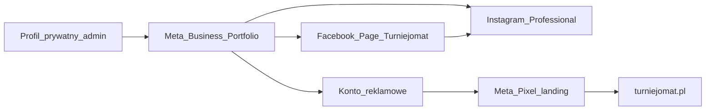

# Turniejomat na Facebooku — plan A–Z

> Równoległy tor marketingowy (zapis: 2026-07-17).  
> Cel: oficjalna obecność marki na Meta — **Facebook Page + Business Portfolio + Instagram Professional**.  
> Status: do wdrożenia później (nie zablokowany przez prace w produkcie).

## Rekomendacja formatu (najlepsze opcje)

| Forma | Werdykt | Dlaczego |
|--------|---------|----------|
| **Profil prywatny „Turniejomat”** | Odrzucone | Narusza regulamin Meta (firma ≠ osoba), limit ~5000 znajomych, brak Ads/Insights, ryzyko blokady |
| **Grupa FB** | Później (opcjonalnie) | Dobra jako społeczność organizatorów *po* fanpage; nie zastępuje strony marki |
| **Facebook Page (fanpage)** | **Główny wybór** | Publiczna marka, nielimitowani obserwujący, CTA, Insights, Ads, Messenger |
| **Meta Business Portfolio** (dawniej Business Manager) | **Obowiązkowy backend** | Strona/reklamy należą do firmy, nie do jednej osoby; 2FA, role, bezpieczeństwo |
| **Instagram Professional** (Business) | **Od razu z FB** | Ten sam ICP (organizatorzy + rodzice); wspólny inbox w Meta Business Suite; reklamy cross-platform |
| **WhatsApp Business** | Faza 2 | Numer `+48 517 246 034` — CTA „Napisz” po ustabilizowaniu Page |

**Decyzja:** jedna **Page „Turniejomat”** + **Business Portfolio** na `admin@turniejomat.pl` + **IG Professional** powiązany z Page. Bez profilu firmowego udającego osobę.

---

## Checklist faz

> **Pakiet do odhaczenia (teksty gotowe):** [TOR3_FB_SEO_EXECUTE.md](TOR3_FB_SEO_EXECUTE.md) · soft launch: [TOR3_SOFT_LAUNCH_KONTAKTY.csv](TOR3_SOFT_LAUNCH_KONTAKTY.csv)

- [ ] Faza 0: 2FA, assety avatar/cover, bio, username, dane firmowe
- [ ] Faza 1: utworzenie Facebook Page Turniejomat + CTA/kontakt
- [ ] Faza 2: Meta Business Portfolio, przejęcie Page, Ad Account, 2FA
- [ ] Faza 3: Instagram Professional + powiązanie z Page
- [ ] Faza 4: 5 postów startowych (pillary sales kitu) — treść w TOR3_FB_SEO_EXECUTE.md
- [ ] Faza 5: linki FB/IG na turniejomat.pl + opcjonalny Pixel *(PR po finalnym URL Page)*
- [ ] Faza 6–7: soft launch, grupy, pierwszy test Ads, checklista „gotowe”

---

## Faza 0 — Przygotowanie (1 dzień, offline)

- **Konto prywatne FB** właściciela (Kris) — aktywne, 2FA (aplikacja, nie SMS), e-mail zweryfikowany. To tylko „klucz”, nie twarz marki.
- **E-mail firmowy:** `admin@turniejomat.pl` (już w legalach landingu).
- **Nazwa prawna / dane firmowe** do Portfolio (zgodne z fakturami / CEIDG/KRS).
- **Assety graficzne** (z repo: `landing/logo.webp`, `landing/icon.webp`, kolory z `landing/css/brand-tokens.css`):
  - Avatar: logo na tle navy `#0b1f33`, kwadrat **180×180** (docelowo 320×320).
  - Cover FB: **820×312** (bezpieczna strefa środka) — hasło: *„Spokój organizatora w dniu turnieju”* + `turniejomat.pl` + QR/demo.
  - Avatar IG: to samo logo (kwadrat).
- **Username:** dążyć do `facebook.com/turniejomat` / `@turniejomat` (sprawdzić wolność; wariant: `turniejomat.pl`).
- **Kategoria Page:** m.in. *Oprogramowanie* / *Usługa biznesowa* / *Sport* (Meta podpowiada — wybrać 1–3, nie „Lokal gastronomiczny”).
- **Bio (≤255 znaków), szkic:**  
  *Koniec z chaosem w dniu turnieju. Wyniki live dla rodziców, tabele i podium po finale. Hala, orlik, boisko szkolne. Demo 2 min → turniejomat.pl*

---

## Faza 1 — Utworzenie Page (dzień 1)

1. Zalogowany profil prywatny → [facebook.com/pages/create](https://www.facebook.com/pages/create) (lub przez Meta Business Suite).
2. Nazwa: **Turniejomat**.
3. Od razu: avatar, cover, opis, www `https://turniejomat.pl`, e-mail, telefon `+48 517 246 034`.
4. **Przycisk CTA:** „Dowiedz się więcej” / „Zarezerwuj” → `https://turniejomat.pl` (lub demo: `https://demo.turniejomat.pl`).
5. Ustawienia: wiadomości włączone; kraj PL; język PL; godziny „zawsze otwarte” lub „tylko online”.
6. **Nie** publikować Page jako „pusty” na feed znajomych admina — najpierw 3–5 postów startowych (Faza 4).

---

## Faza 2 — Meta Business Portfolio (dzień 1–2)

1. [business.facebook.com](https://business.facebook.com) → utwórz Portfolio: nazwa **Turniejomat** / nazwa prawna podmiotu.
2. E-mail biznesowy: `admin@turniejomat.pl` → potwierdź link.
3. **Accounts → Pages:** dodaj / przejmij Page (własność firmy).
4. Włącz **2FA wymagane dla wszystkich** w Security Center.
5. **Ad Account:** utwórz konto reklamowe (PLN, PL, strefa Europe/Warsaw) — nawet bez budżetu; przyda się później.
6. **Nie** dodawać agencji na Admin, dopóki nie trzeba — tylko Ty jako admin.

---

## Faza 3 — Instagram Professional (dzień 2)

1. Konto IG `@turniejomat` (lub wolny wariant) → przełącz na **Konto profesjonalne → Firma**.
2. Połącz z Facebook Page w ustawieniach IG / Business Suite.
3. Bio spójny z FB + link w bio: `turniejomat.pl` (ew. Linktree później).
4. Wspólny **Inbox** w Meta Business Suite (FB + IG DM).

---

## Faza 4 — Start contentowy (dzień 2–3, zanim „ogłosicie” stronę)

Pillary z sales kitu (ton: Ty/Twój turniej, bez „SaaS/moduły”):

1. **Pinned / o nas** — spokój dnia turnieju + link demo.
2. **Problem rodziców** — „jaki wynik?” / WhatsApp vs QR live.
3. **Auto podium** — jeden wpis finału → podium / król strzelców.
4. **Cena** — weekend **79 zł** vs wpisowe jednej drużyny; miesięczny **149 zł** od 2 turniejów.
5. **Demo 2 min** — `demo.turniejomat.pl` (Memoriał / 16 drużyn / finał).

Częstotliwość startu: **3 posty/tydzień** FB (+ ten sam lub skrót na IG). Stories: QR, screen hali, „przed/po”.

---

## Faza 5 — Integracja z produktem (tydzień 1–2)

- Na landingu `landing/index.html`: ikony/linki FB (+ IG) w stopce — gdy URL Page będzie finalny.
- Opcjonalnie **Meta Pixel** na `turniejomat.pl` (zdarzenia: ViewContent, Lead/Contact, Purchase jeśli Autopay pozwala) — pod remarketing po pierwszym ruchu organicznym.
- Regulamin / polityka: strona firmowa może linkować do `landing/legal/` (już istnieją).

---

## Faza 6 — Dystrybucja i wzrost (tydzień 2+)

- Soft launch: wiadomość do 20–50 organizatorów z sieci (bez spamu grup).
- Dołączenie (jako Page) do grup FB: turnieje piłkarskie / OSiR / trenerzy — **wartość + link do demo**, nie cold spam.
- Pierwszy test Ads (budżet mały, np. 20–50 zł/dzień, 5–7 dni): lookalike później; na start zainteresowania *piłka nożna, trener, klub sportowy* + retargeting wejść na landing.
- CTA w Ads: **Demo Story**, nie od razu „kup licencję”.

---

## Faza 7 — Checklista „gotowe na stałe”

- [ ] Page live, username ustalony
- [ ] Portfolio + 2FA + Page w Portfolio
- [ ] IG Professional połączony
- [ ] CTA + kontakt + www
- [ ] 5 postów startowych + wyróżniony
- [ ] Linki social na turniejomat.pl
- [ ] (Opc.) Pixel + konto reklamowe z metodą płatności
- [ ] Szablon odpowiedzi Messenger (demo / cennik / kontakt)

---

## Czego nie robić

- Nie budować marki na **profilu prywatnym**.
- Nie używać prywatnego Gmaila jako jedynego e-maila Portfolio.
- Nie dawać pełnego Admina freelancera bez Portfolio.
- Nie obiecywać w postach funkcji, których nie ma na prod (trzymać się landingu + demo).

---

## Równoległość względem produktu

Ten tor **nie blokuje** pracy w repo. Jedyny styk z kodem: dodanie linków social w stopce landingu **po** uzyskaniu finalnego URL Page (osobny mały PR, gdy będziesz gotów).

## Kontekst marki (skrót)

- Hasło: *Spokój organizatora w dniu turnieju*
- ICP: organizatorzy turniejów halowych ~12–20 drużyn
- Ceny: weekend **79 zł** / miesięczny **149 zł**
- Domeny: `turniejomat.pl` · `app.` · `demo.` · `admin.`
