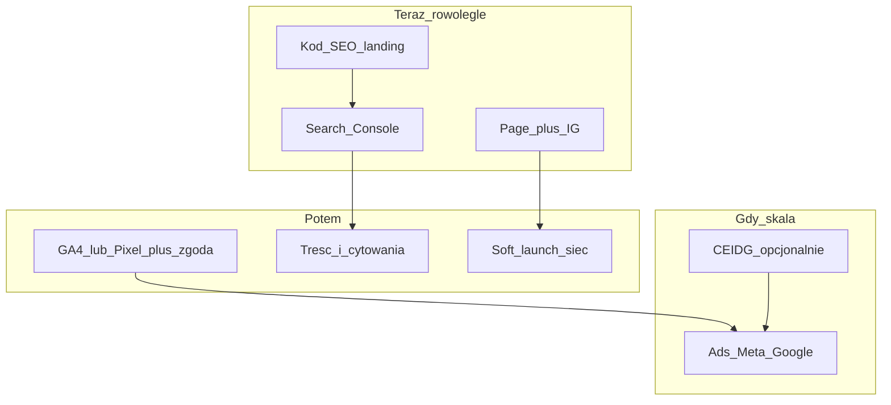

# Turniejomat.pl — od istnienia do widoczności (SEO + social + ruchy offline)

> Równoległy tor widoczności (zapis: 2026-07-17).  
> Cel: indeksacja w Google + obecność marki (FB/IG) + jasna kolejność kod vs offline.  
> Status: do wdrażania etapami (PR1 = fundament SEO; FB/IG równolegle; bez push na `main` bez Twojej zgody).  
> Powiązane: [FACEBOOK_TURNIEJOMAT_A_Z.md](FACEBOOK_TURNIEJOMAT_A_Z.md).

## Werdykt na start

Strona **już działa** na `https://turniejomat.pl` (osobny Netlify `landing/`), ale **wyszukiwarki prawie nie mają czego indeksować i mierzyć**: brak `robots.txt` / `sitemap.xml`, brak Open Graph / JSON-LD / canonical, brak Search Console, brak analytics. App (`app.` / `demo.` / `admin.`) nie powinna konkurować z landinguem w Google.

**Czy wcześniej FB/IG?** Tak — **profil firmowy (Page + IG) warto założyć w tym samym tygodniu co fundament SEO**, zanim Ads i zanim „ogłosicie” markę. **Nie czekaj** z kodem SEO na FB; **nie czekaj** z Page na „idealny produkt”. Ads zostaw na później (limity + rozliczenia przy NDG).

---

## Odpowiedź: działalność nierejestrowana a profil firmowy FB

| Co chcesz | Przy NDG (bez CEIDG) | Status |
|-----------|----------------------|--------|
| **Facebook Page „Turniejomat”** (fanpage marki) | **Tak** — nie wymaga wpisu CEIDG / NIP firmowego | **Możliwe i zalecane teraz** |
| **Instagram Professional (Firma)** | **Tak** — to samo | **Możliwe teraz** |
| **Meta Business Portfolio** (zarządzanie Page/Ads) | **Tak** na poziomie podstawowym (e-mail `admin@turniejomat.pl`, 2FA) | **Możliwe teraz** |
| **Małe Ads** (niski budżet, bez pełnej weryfikacji firmy) | **Zwykle tak**, z **niższymi limitami** i bez części funkcji (np. Custom Audiences z list) | **Opcja później** |
| **Business Verification** (pełna weryfikacja firmy Meta) | **Praktycznie nie** — Meta oczekuje dokumentów rejestrowych (CEIDG/KRS, NIP, faktury na firmę) | **Po rejestracji JDG/CEIDG** |
| **Profil prywatny zamiast Page** | Narusza regulamin Meta dla marki | **Odrzucone** (jak w FACEBOOK_TURNIEJOMAT_A_Z.md) |

**Wniosek:** NDG **nie blokuje** zbudowania oficjalnego profilu firmowego (Page + IG). Blokuje głównie **dojrzały tor reklamowy** (weryfikacja, wyższe limity). Przy zakupie Ads od Meta/Google przy NDG bywają obowiązki VAT (import usług) — to osobna decyzja księgowa, nie warunek założenia Page.

**Opcje formy prawnej vs marketing:**

1. **Zostać na NDG + Page/IG + SEO organiczne** — legalny tor startowy; Ads tylko testowo / mały budżet.
2. **NDG + Page teraz, CEIDG gdy rosną Ads / faktury B2B** — rekomendowany kompromis.
3. **Najpierw CEIDG, potem Page** — zbędne opóźnienie; Page i tak możesz mieć na markę „Turniejomat”.

---

## Stan obecny (luka)

- Landing: title + description w `landing/index.html` — **bez** OG/Twitter/canonical/JSON-LD.
- Brak `landing/robots.txt`, `landing/sitemap.xml`.
- Brak GA4 / Pixel / CMP; polityka prywatności już przewiduje analytics później (`landing/legal/polityka-prywatnosci.html`).
- CSP w `landing/_headers` — przy analytics trzeba rozszerzyć.
- Plan Meta: `docs/FACEBOOK_TURNIEJOMAT_A_Z.md` — gotowy, nie wdrożony.
- App SPA: brak `noindex` na `app.`/`demo.`/`admin.` — ryzyko śmieciowych wyników.

---

## Checklist faz

- [ ] Faza A: fundament indeksacji (robots, sitemap, OG, JSON-LD, noindex app)
- [ ] Faza B: Facebook Page + IG Professional + Portfolio (NDG OK)
- [ ] Ops: Google Search Console + sitemap + Request indexing
- [ ] Faza C1: linki FB/IG w stopce landingu
- [ ] Faza C2–C3: CMP + GA4/Pixel (później)
- [ ] Faza D: soft launch + cytowania
- [ ] Faza E: podstrony treści / FAQ
- [ ] Faza F: Ads (po organice; CEIDG gdy skala)

---

## Faza A — Fundament indeksacji (kod, obowiązkowe, pierwszy PR)

Cel: Google **może** znaleźć, zrozumieć i pokazać landing.

| # | Zadanie | Gdzie | Obowiązek |
|---|---------|-------|-----------|
| A1 | `robots.txt`: `Allow: /`, `Sitemap: https://turniejomat.pl/sitemap.xml` | `landing/robots.txt` | **Obowiązkowe** |
| A2 | `sitemap.xml`: `/`, `/platnosci.html`, `/legal/*` (bez `/dziekujemy.html`) | `landing/sitemap.xml` | **Obowiązkowe** |
| A3 | Canonical + OG + Twitter + obraz ~1200×630 | `landing/index.html` (+ asset `landing/og-cover.webp` lub `.jpg`) | **Obowiązkowe** |
| A4 | JSON-LD: `Organization` + `SoftwareApplication` / `Offer` (79/149 zł) | `landing/index.html` | **Obowiązkowe** |
| A5 | Meta description na legal/płatności; `dziekujemy` już `noindex` | podstrony landing | **Obowiązkowe** |
| A6 | `noindex,nofollow` na hostach app/demo/admin (meta lub `_headers`) | root `index.html` / `_headers` | **Obowiązkowe** |

**Po deploy landingu:** Google Search Console → własność domeny (DNS TXT u rejestratora) → prześlij sitemap → „Poproś o zindeksowanie” URL głównego. To ruch **offline/ops**, nie kod — ale bez A1–A2 GSC jest ślepy.

Bing Webmaster — ten sam sitemap (opcjonalnie, niski koszt).

---

## Faza B — Profil firmowy Meta (offline, równolegle z A, obowiązkowe dla marki)

Zgodnie z [FACEBOOK_TURNIEJOMAT_A_Z.md](FACEBOOK_TURNIEJOMAT_A_Z.md), **przy NDG wystarczy:**

1. Profil prywatny właściciela + **2FA** (tylko klucz admina).
2. **Facebook Page „Turniejomat”** — avatar, cover, bio, www, telefon, CTA → `turniejomat.pl`.
3. **Instagram Professional** → Firma → powiązanie z Page.
4. **Business Portfolio** na `admin@turniejomat.pl` — Page w Portfolio, 2FA.
5. **3–5 postów startowych** zanim Page „wyleci” do znajomych (demo, problem rodziców, cena, podium).
6. **Nie** wymuszać Business Verification ani dużego Ads przy NDG.

**Kod dopiero gdy masz finalny URL Page:** linki FB/IG w stopce `landing/index.html` (mały PR) — Faza C poniżej.

---

## Faza C — Styk social ↔ produkt (kod, mały)

| # | Zadanie | Obowiązek |
|---|---------|-----------|
| C1 | Ikony/linki FB + IG w stopce landingu | Po gotowym URL Page |
| C2 | Meta Pixel / GA4 | **Nie obowiązkowe na start** — po CMP + aktualizacji CSP + polityce |
| C3 | Cookie / zgoda (CMP) przed skryptami tracking | **Obowiązkowe przed** analytics (RODO) |

Kolejność: najpierw A + B, potem C1. C2–C3 dopiero gdy chcesz mierzyć konwersje / Ads.

---

## Faza D — Widoczność poza Google (offline, obowiązkowe / zalecane)

| # | Kanał | Uwagi |
|---|-------|-------|
| D1 | **Google Search Console** + sitemap | **Obowiązkowe** |
| D2 | Soft launch: 20–50 organizatorów z sieci + link demo | **Obowiązkowe** do pierwszych sygnałów |
| D3 | Cytowania: katalogi lokalne / sportowe (ostrożnie, bez spamu) | Zalecane |
| D4 | **Google Business Profile** | Tylko jeśli realnie obsługujesz obszar / masz adres do weryfikacji; czysty SaaS online często **odkłada się** albo robi jako „usługa w obszarze” — nie blokuje SEO landingu |
| D5 | Grupy FB (jako Page): wartość + demo, nie spam | Po B |
| D6 | YouTube / short „demo 2 min” | Opcjonalne, mocne SEO video |

---

## Faza E — Treść i ranking (kolejne PR-y w kodzie, iteracyjnie)

Google indeksuje **treść**. Landing jest cienki pod long-tail.

Kolejne rozwiązania w repo (po A):

1. Podstrona `/dla-organizatorow.html` lub sekcje H2 pod zapytania: *wyniki live turniej*, *aplikacja turniej piłkarski*, *tabela grupowa hala*.
2. Strona `/demo` lub mocniejszy CTA do `demo.turniejomat.pl` z opisem (indeksowalny tekst, nie tylko iframe).
3. FAQ + `FAQPage` JSON-LD.
4. Blog / case study — dopiero gdy jest czas; nie blokuje startu.

---

## Faza F — Ads i „sukces skalowany” (opcjonalne, po organice)

- Mały test Ads **po** Page + Pixel/zgoda + pierwszych organicznych wejściach.
- Przy NDG: świadomie mały budżet / limity; rozważyć **CEIDG**, gdy Ads stają się stałym kanałem lub potrzebujesz pełnej weryfikacji Meta.
- CTA w Ads: **Demo**, nie od razu „kup licencję”.

---

## Co jest obowiązkowe vs opcjonalne (checklista „sukces startowy”)

**Obowiązkowe do „pojawić się w wyszukiwarkach sensownie”:**

1. robots + sitemap + deploy landingu
2. meta/OG/canonical/JSON-LD na stronie głównej
3. `noindex` na app/demo/admin
4. Google Search Console + prośba o indeksację
5. Stabilny HTTPS i www→apex (już jest w `landing/netlify.toml`)

**Obowiązkowe do „marka istnieje w social” (nie do indeksacji Google):**

6. Facebook Page + IG Professional + Portfolio podstawowe
7. Linki social na landingu

**Opcjonalne / później:**

- GA4, Pixel, CMP
- Ads Meta/Google
- GBP, blog, YouTube
- CEIDG + Business Verification

**Sukces startowy (definicja):** landing w GSC ze statusem zindeksowanym, snippet z poprawnym tytułem/opisem/OG, Page+IG live z 5 postami, pierwsze wejścia z soft launch — bez Ads.

---

## Kolejność budowania w kodzie (kolejne rozwiązania)

1. **PR1 (ten tor):** Faza A — robots, sitemap, OG, JSON-LD, noindex app hosts.
2. **Offline równolegle:** Faza B — Page + IG (NDG OK).
3. **PR2:** stopka social (C1) gdy URL Page gotowy.
4. **PR3:** CMP + GA4/Pixel (C2–C3) gdy chcesz pomiar.
5. **PR4+:** podstrony treści / FAQ (Faza E).

Bez push na `main`, dopóki nie zatwierdzisz każdego PR — jak dotychczas.

---

## Czego nie robić

- Nie budować marki na profilu prywatnym FB.
- Nie odpalać Pixel/GA bez zgody i poprawy CSP.
- Nie indeksować panelu organizatora / demo deep-linków.
- Nie kupować masowych backlinków / katalogów-śmieci.
- Nie blokować SEO czekaniem na CEIDG lub Ads.

---

## Kontekst marki (skrót)

- Hasło: *Spokój organizatora w dniu turnieju*
- ICP: organizatorzy turniejów halowych ~12–20 drużyn
- Ceny: weekend **79 zł** / miesięczny **149 zł**
- Domeny: `turniejomat.pl` · `app.` · `demo.` · `admin.`
